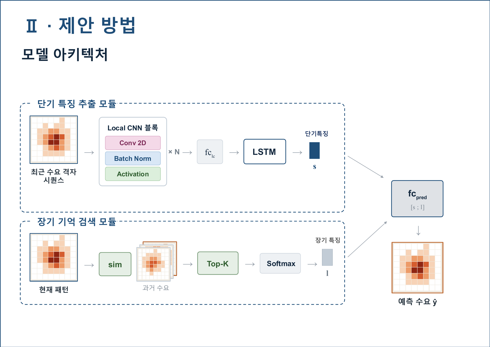

# Lambda-F: 유사도 검색을 통한 장기 기억 강화 기반 교통 수요 예측 모델

### Lambda-F: Long-term Augmented Memory-Based Traffic Demand Forecasting Model via Similarity Retrieval (KCC 2026, 장려상)

by 김진수, 김종익

충남대학교 인공지능학과

## 🔎 Abstract

도시 교통 수요는 평소 완만한 저주파 흐름을 보이다가, 콘서트·행사처럼 비정기적인 사건이 발생하면 고주파 급변이 갑자기 끼어든다. 최근 관측 시퀀스만 참조하는 전통적인 모델은 이런 장기 반복 패턴을 놓치고, 반대로 고정 주기(예: 일주일 전 같은 시간)를 참조하는 모델은 비주기적인 급변을 놓친다. Lambda-F는 고정 주기 가정 대신 현재 수요 패턴과 유사한 과거 구간을 유사도 검색(retrieval)으로 찾아 선택적으로 참조하고, 이를 단기 LSTM 특징과 주파수 적응적으로 융합해 장기 기억을 반영한다. 울산 택시 수요 데이터로 검증한 결과 Moving Average, ARIMA, DMVST-Net, ST-ResNet 대비 MAPE·RMSE 모든 지표에서 최저 오차를 달성했다.

## 💡 Why Lambda-F works?

### 1. Motivation

최근 시퀀스만 보는 모델은 장기 패턴을, 고정 주기로 참조하는 모델은 비주기적 급변을 놓친다. 두 접근 모두 "과거의 어떤 시점을, 얼마나 반영할지"를 데이터에 맞게 정하지 못한다는 한계가 있다.

### 2. Our Contribution

- **선택적 장기 기억 검색 모듈**: 고정 주기 참조 없이, 현재 패턴과 유사한 과거 수요 구간을 Top-K 유사도 검색으로 찾아 정답을 유사도 가중합함으로써 비주기적인 장기 패턴까지 반영하는 retrieval 기반 장기 기억 모듈을 제안했다.
- **주파수 적응적 단기·장기 융합**: 단기 특징(Local CNN + LSTM, 고주파 민감)과 장기 특징(retrieval, 저주파 민감)을 fusion layer(fc_pred)에서 결합하되, 입력의 주파수 성분에 따라 반영 비중이 자동으로 조절되도록 설계해 급변·피크 구간과 완만·반복 구간 모두를 하나의 모델로 대응했다.
- **실증적 성능 우위 검증**: 울산 택시 수요 데이터에서 기존 비교군 대비 MAPE·RMSE 모두 최저치를 달성했고, 특히 저수요(한산)·고수요(혼잡) 양 극단 지역 모두에서 우위를 보여 검색 기반 장기 기억 반영이 수요 규모와 무관하게 효과적임을 입증했다.

## 🖼️ Model Architecture

## 📊 Results

울산 택시 수요 데이터(2024.10–2025.3, 169개 격자 노드, 1시간 단위, 학습/검증/평가 0.7/0.1/0.2)로 Moving Average, ARIMA, DMVST-Net, ST-ResNet과 비교했다.

| 모델 | MAPE (↓) | RMSE (↓) |
|---|---|---|
| Moving Average | 25.72 | 0.854 |
| ARIMA | 25.21 | 0.797 |
| DMVST-Net | 22.14 | 0.739 |
| ST-ResNet | 19.06 | 0.742 |
| **Lambda-F (Ours)** | **17.97** | **0.730** |

Lambda-F가 MAPE·RMSE 모든 지표에서 비교군 중 최저를 기록했다. 장기 기억 검색 모듈이 없는 base 구조인 DMVST-Net 대비로는 MAPE가 약 18.8% 상대적으로 낮아졌고, 비교군 중 최고 성능이던 ST-ResNet 대비로도 MAPE를 약 5.7% 더 낮췄다.

## 📖 Paper

- 논문: [KCC_extended_v7.pdf](KCC_extended_v7.pdf)
- 발표자료: [Lambda-F.pdf](Lambda-F.pdf)
- 상세 파이프라인 문서: [docs/pipeline.md](docs/pipeline.md)
